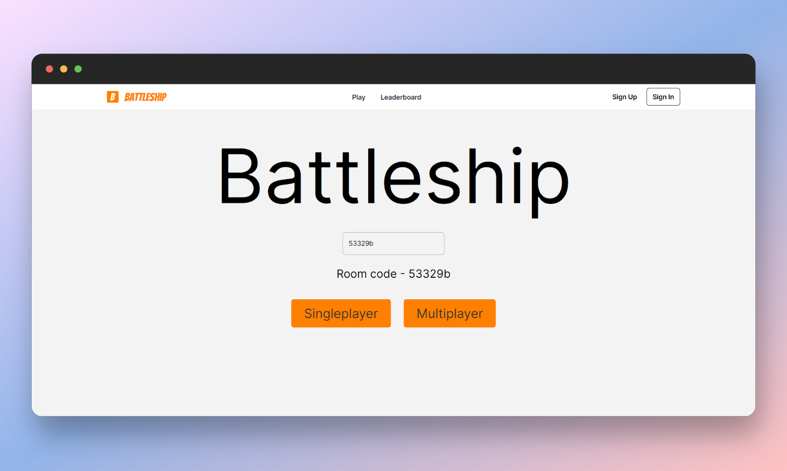
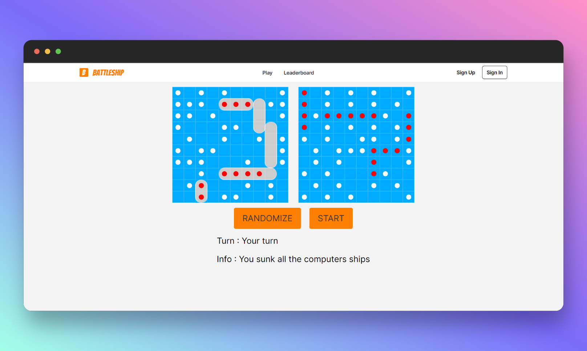
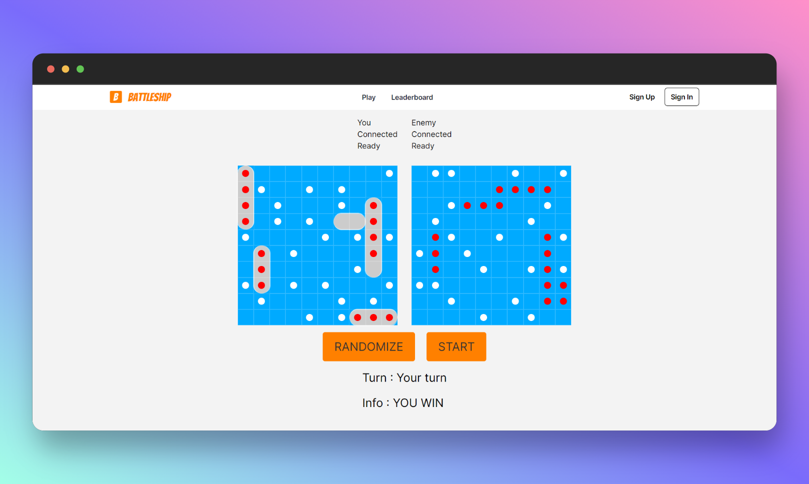

# Battleship 🚢

#### Link - [https://battleship1.netlify.app/play](https://battleship1.netlify.app/play)

### Battleship is a strategy type guessing game for two players.
It is played on ruled grids (paper or board) on which each player's fleet of warships are marked. The locations of the fleets are concealed from the other player. Players alternate turns calling "shots" at the other player's ships, and the objective of the game is to destroy the opposing player's fleet.



### Technologies used
- NextJs -> Frontend framework
- Tailwind CSS -> CSS styling
- ExpressJs -> Node server
- Socketio -> Sockets
- Flywheel -> Leaderboard
- Firebase -> Authorization an Storage

### Features
1. Singleplayer mode
  
2. Multiplayer mode
  
3. Authorization by Firebase
   
4. Realtime Leaderboard


### Cloning project
```shell
git clone https://github.com/mgautam07/Battleship.git
cd Battleship
npm run start
```

## Installing backend dependencies
```shell
cd backend
npm i
npm run dev
```

## Installing frontend dependencies
```shell
cd frontend
npm i
```
